# 🏥 Web-Based Health Insurance Management System

A secure, web-based platform that digitizes and automates health insurance services — connecting **policyholders**, **agents**, **hospitals**, and **administrators** on a single system for policy management, claims processing, and premium payments.

**Group:** MLB-B2G2-09

| Reg. No | Name |
|---|---|
| IT25101964 | Sarathchandra G.W.S.I |
| IT25102885 | Dhimantha W.L.T |
| IT25103980 | Perera W.W.M.D |
| IT25101957 | Lakshani J.D.C |
| IT25103984 | Jayalath W.A.D |
| IT25101054 | Nemsith K.B.N |

> ✏️ Note: Please double-check/complete the first member's registration number — it wasn't fully legible in the source slide.

---

## 📖 Overview

Health insurance in many organizations still relies heavily on manual paperwork, causing delays in policy issuance, slow claim processing, and poor communication between stakeholders. This project replaces that manual process with a **secure web platform** that lets users:

- Purchase and renew insurance policies
- Submit and track insurance claims
- Make secure premium payments
- Connect hospitals and insurance providers digitally

---

## 🎯 Objectives

- Digitize health insurance processes and simplify policy management
- Accelerate claim processing and enable secure online payments
- Improve stakeholder communication and operational efficiency
- Ensure security, transparency, and reduced manual errors
- Provide reliable, accessible, and scalable services

---

## 🏗️ System Architecture

```mermaid
flowchart LR
    subgraph Users["👤 Users"]
        U1[Policy Holder]
        U2[Agent / Insurance Staff]
        U3[Hospital / Provider]
        U4[Admin]
    end

    subgraph WebApp["🌐 Web Application"]
        F1[Insurance Policy Management]
        F2[Medical Claim Management]
        F3[Hospital Verification & Treatment Management]
        F4[Premium Payment Management]
        F5[Customer Support & Complaint Management]
        F6[Reporting & System Administration]
    end

    subgraph AppServer["⚙️ Application Server"]
        A1[Process Requests]
        A2[Business Logic]
        A3[Validate Data]
        A4[Generate Responses]
    end

    subgraph DBServer["🗄️ Database Server"]
        D1[(Store / Manage / Retrieve Data)]
    end

    subgraph External["🔌 External Services"]
        E1[💳 Payment Gateway]
        E2[✉️ Email Service]
        E3[📱 SMS Service]
        E4[☁️ Document Storage]
    end

    Users --> WebApp
    WebApp <--> AppServer
    AppServer <--> DBServer
    AppServer --> External
```



**Layers:**
1. **Client Layer** – Web app used by policyholders, agents, hospital staff, and admins
2. **Application Server** – Spring Boot backend handling business logic, validation, and requests
3. **Database Server** – MySQL database storing policies, claims, payments, and user data
4. **External Services** – Payment gateway, email/SMS notifications, and secure document storage

---

## 👥 Stakeholders

| Stakeholder | Role |
|---|---|
| **Policyholders / Customers** | End-users who purchase policies, pay premiums, and submit claims online |
| **Insurance Claims Officers & Agents** | Review claim documents, assess risk, and approve payouts |
| **Healthcare Providers / Network Hospitals** | Verify patient coverage and submit direct treatment bills |
| **System Administrator** | Manage user roles, access security, and system performance reports |

---

## ✨ Features

### Major Functions
| Module | User | Key Tasks |
|---|---|---|
| Insurance Policy Management | Customer / Insurance Admin | Browse packages, create policies, renew coverage, cancel plans |
| Medical Claim Management | Policyholder / Claim Officer | Submit claims, upload medical receipts, verify docs, approve/reject claims |
| Premium Payment Management | Policyholder / Finance Admin | Process online payments, generate receipts, track transaction history |
| Hospital Verification & Treatment Management | Hospital Staff / Admin | Verify insurance eligibility, upload diagnosis records, submit medical bills |
| Customer Support & Complaint Management | All users | Log inquiries, submit complaints, track resolution status |
| Reporting & System Administration | System Admin | Manage user access/roles, generate analytics reports, monitor system logs |

### Minor Functions
- 🔐 User Authentication — secure sign-up, login, logout, multi-factor authentication
- 🔑 Password Management — forgot password, reset via email/OTP
- 🧾 Profile Management — edit personal details, update contact info
- 🔍 Search & Filter — search policies, claims, and payment records
- 🔔 Notifications — email/SMS alerts for due dates and claim updates
- 💬 Customer Support — handles inquiries, complaints, and feedback

---

## 📋 Requirements

### Functional
- Create, purchase, renew, and cancel insurance policies
- View policy details and manage claims end-to-end

### Non-Functional
| Quality | Description |
|---|---|
| ⚡ Performance | Fast response time with efficient system performance |
| 🔒 Security | Secure authentication and protection of user data |
| 🛡️ Reliability | High availability with reliable data backup |
| 😊 Usability | User-friendly and responsive interface |
| 📈 Scalability | Supports future growth and increasing users |
| 🔧 Maintainability | Easy to update and maintain |

---

## 🚧 System Limitations / Constraints

- 🌐 Requires an active internet connection for real-time claims and policy features
- 🔗 Online payments depend on third-party payment gateway availability/uptime
- 🏥 Automated verification and direct billing apply only to partner-registered hospitals
- ⚖️ Data handling must comply with national health data privacy laws
- 📩 Automated SMS/email notifications are limited by third-party service quotas

---

## 🛠️ Tech Stack

- **Backend:** Java, Spring Boot (Spring Web, Spring Data JPA, Spring Security)
- **Database:** MySQL
- **Frontend:** HTML, CSS, JavaScript (or React, depending on final implementation)
- **Build Tool:** Maven
- **Other:** REST APIs, JWT Authentication

---

## 📁 Project Structure

```
health-insurance-management-system/
├── src/
│   ├── main/
│   │   ├── java/com/mlb/healthinsurance/
│   │   │   ├── controller/         # REST controllers (Policy, Claim, Payment, Auth...)
│   │   │   ├── service/            # Business logic layer
│   │   │   ├── repository/         # Spring Data JPA repositories
│   │   │   ├── model/              # Entity classes (Policy, Claim, User, Payment)
│   │   │   ├── dto/                # Request/response DTOs
│   │   │   ├── config/             # Security & app configuration
│   │   │   └── HealthInsuranceApplication.java
│   │   └── resources/
│   │       ├── application.properties
│   │       └── static/ | templates/
│   └── test/                       # Unit & integration tests
├── pom.xml
└── README.md
```

---

## ⚙️ Getting Started

### Prerequisites
- Java 17+
- Maven 3.8+
- MySQL 8+

### 1. Clone the repository
```bash
git clone https://github.com/<your-org>/health-insurance-management-system.git
cd health-insurance-management-system
```

### 2. Configure the database
Create a MySQL database and update `src/main/resources/application.properties`:
```properties
spring.datasource.url=jdbc:mysql://localhost:3306/health_insurance_db
spring.datasource.username=root
spring.datasource.password=yourpassword
spring.jpa.hibernate.ddl-auto=update
spring.jpa.show-sql=true
```

### 3. Build and run
```bash
mvn clean install
mvn spring-boot:run
```

The API will start on **`http://localhost:8080`**

### 4. Sample REST endpoint (Policy Management)
```java
@RestController
@RequestMapping("/api/policies")
public class PolicyController {

    @Autowired
    private PolicyService policyService;

    @PostMapping
    public ResponseEntity<Policy> createPolicy(@RequestBody PolicyDTO dto) {
        return ResponseEntity.ok(policyService.createPolicy(dto));
    }

    @GetMapping("/{id}")
    public ResponseEntity<Policy> getPolicy(@PathVariable Long id) {
        return ResponseEntity.ok(policyService.getPolicyById(id));
    }
}
```

---

## 🗓️ Development Timeline

| Phase | Duration | Key Activities |
|---|---|---|
| 1. Project Proposal | Week 3 | Requirement gathering, team roles, proposal presentation |
| 2. System Analysis | Weeks 4–5 | Requirement modeling, Use Case diagram design |
| 3. System Design | Weeks 6–7 | Database ERD, flowcharts, UI/UX prototypes |
| 4. Core Development | Weeks 8–10 | Frontend & backend for the six major functions |
| 5. Testing & Integration | Weeks 11–12 | Module integration, security testing, bug fixing |
| 6. Final Deployment | Weeks 13–14 | Documentation, user guide, deployment, final presentation |

---

## 💡 Conclusion

This system modernizes health insurance operations by moving from manual paperwork to an efficient, automated web platform — improving **efficiency** (faster policy issuance & claims), **accuracy** (fewer manual errors), and **accessibility** (24/7 online access for payments, claims, and policy tracking).

---

## 📄 License

This project was developed for academic purposes as part of a Software Engineering coursework module.
