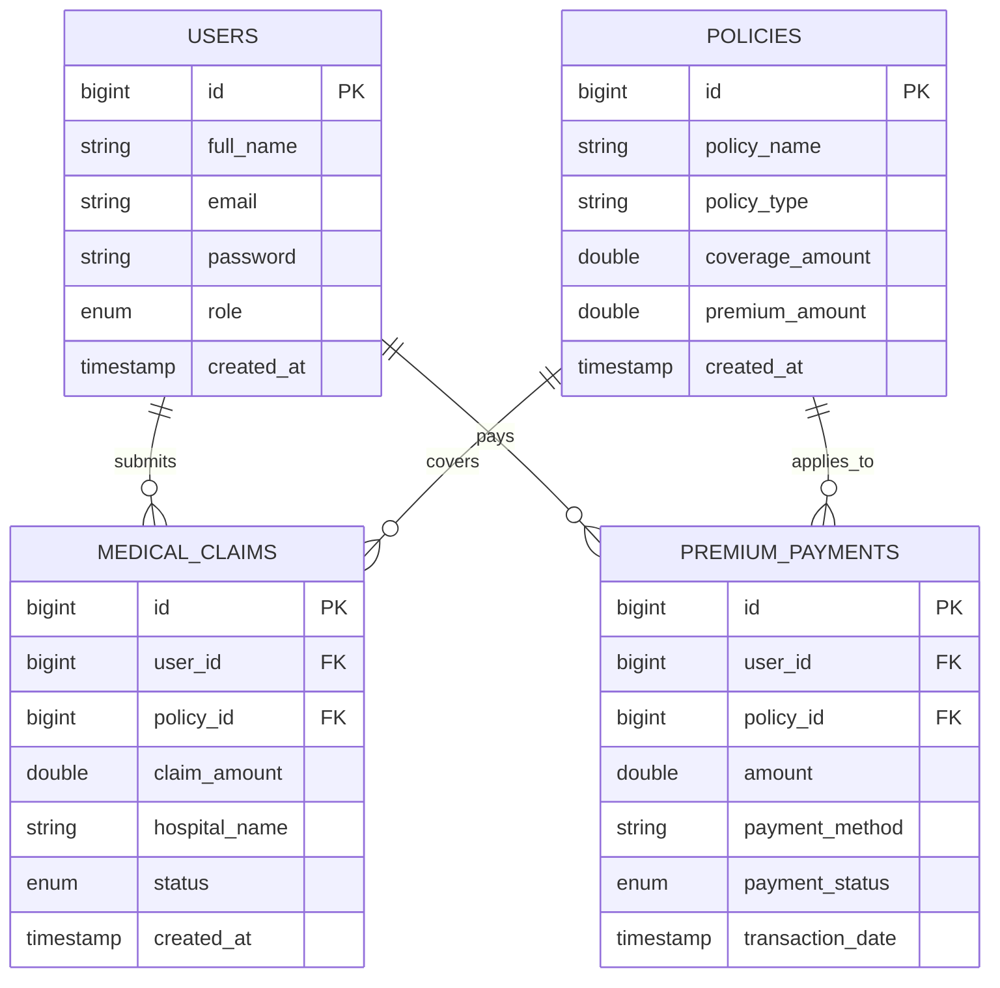

# Entity-Relationship (ER) Diagram Specification

## Overview
This document specifies the database relationships for the **Health Insurance Management System**.

## ER Diagram (Mermaid)

## Entity Descriptions

1. **Users**: Stores system stakeholders (Policyholders, Hospitals, Insurance Staff, Admins).
2. **Policies**: Stores available health insurance coverage packages and pricing.
3. **Medical Claims**: Tracks claims submitted by users for hospital treatment reimbursement.
4. **Premium Payments**: Records transactions for active policy subscriptions.
