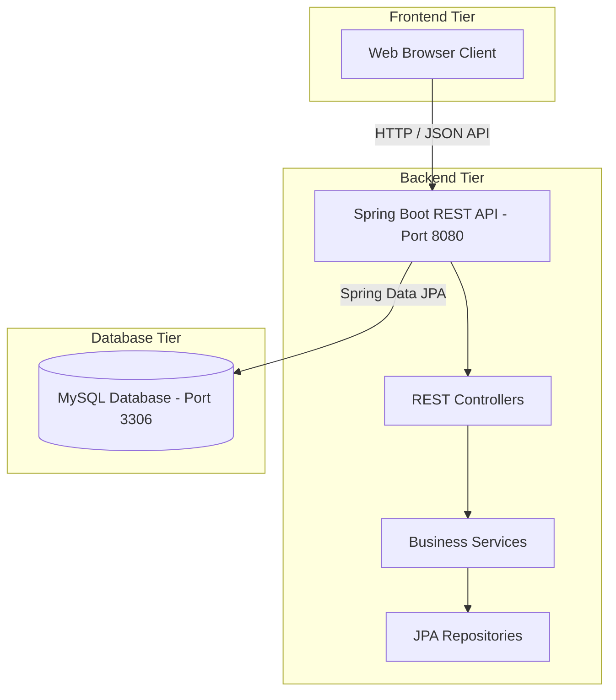

# System Architecture Document

## Overview

The Web-Based Health Insurance Management System follows a 3-Tier Architecture consisting of the Client Layer (Frontend UI), Business Logic Layer (Spring Boot Backend API), and Data Persistence Layer (MySQL Database).

## Architecture Diagram (Mermaid)

## Component Description

1. **Frontend Tier (Vite / Vanilla Web Stack):** Serves interactive UI components for users to submit claims, view policies, and make payments.
2. **Backend Tier (Spring Boot Java REST API):** Encapsulates business logic, security controls, and endpoint routing.
3. **Database Tier (MySQL):** Relational database storing persistent records for users, claims, policies, and transactions.
